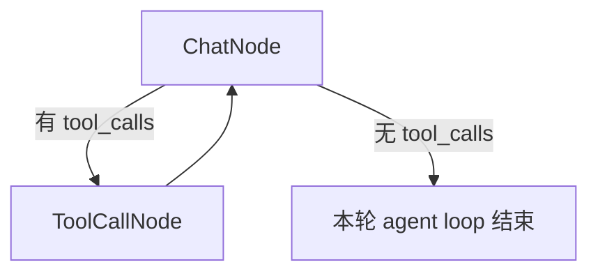
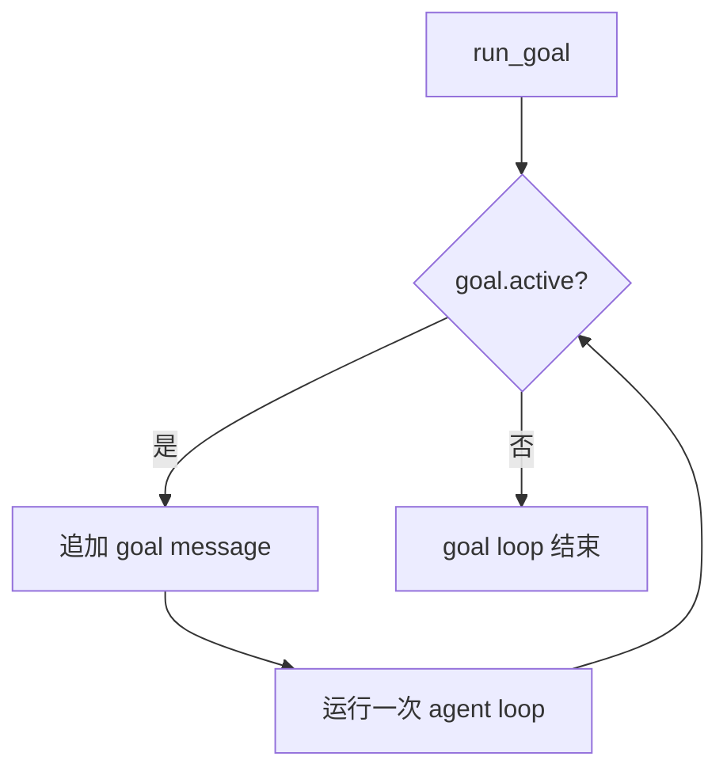

# Agent with Goal - 带 Goal Loop 的工具 Agent

这个例子复制自 `examples/chatbot_with_tools`，在原来的 agent tool loop 外面加了一层最小版 `/goal`。

## 功能

- 保留 `read`, `write`, `edit`, `bash`, `grep`, `find`, `ls`, `search` 工具
- 支持 `/goal <goal>` 启动一个目标，并立刻开始执行
- 支持 `/goal status` 查看当前目标
- 支持 `/goal clear` 清除当前目标
- 额外提供 `goal_complete` tool，用它作为 goal loop 的停止信号
- agent 一轮结束后，如果 goal 还 active，会自动追加同一条 goal message 并继续跑
- 简单聊天目标不需要工具；模型可以直接回复并调用 `goal_complete`

## 运行

```bash
uv run examples/agent_with_goal/main.py
```

## 示例

```text
👤 You: /goal 先 ls .，然后回复 hi，然后 ls core，最后调用 goal_complete
```

## 两层 Loop





这个例子最重要的就是这两个停止条件：

- 内层 agent loop：assistant message 没有 `tool_calls` 时结束
- 外层 goal loop：`goal_complete` tool 被调用时结束

也就是说，普通 agent 可以因为没有工具要调用而停在一轮回复上；但 goal active 时，这只表示“一轮结束”，不表示“目标完成”。只要 `GoalState.active` 还是 `True`，外层 goal loop 就会追加同一条 goal message，让 agent 再跑一轮。

代码对应关系：

- `GoalState`：只保存 `text` 和 `active`
- `goal_message()`：创建写入历史的 goal 提醒消息，启动和续跑都用同一条
- `ChatNode`：调用 LLM，打印 content，并根据 `tool_calls` 决定是否进入 `ToolCallNode`
- `Flow(chat + tool_call)`：组成内层 agent loop
- `make_goal_complete_tool()`：创建 `goal_complete` 工具
- `run_goal()`：表达外层 goal loop；每一轮 agent loop 前都会写入 `goal_message(goal)`
- `run_chat()`：初始化状态、处理 `/goal` 命令，然后选择普通执行或 goal 执行

`goal_complete` 是外层 loop 的结构化停止信号。它不是普通文本回复，而是一个 tool。这个 tool 的函数体很小：

```python
def goal_complete() -> str:
    if not goal.active:
        return "No active goal"
    goal.text = None
    goal.active = False
    return "Goal complete"
```

当这个 tool 被执行后，`goal.active` 从 `True` 变成 `False`，`run_goal()` 里的 `while goal.active` 就会真正结束。

`goal_complete` 会一直放在 tools 列表里，而不是 goal active 时才临时加入。这样每次请求的 tool schemas 更稳定，更利于 prompt/KV cache。没有 active goal 时调用它只会返回 `No active goal`。

主循环里 `/goal` 和普通聊天是两条很明确的路径：

```python
if user_input.startswith("/goal"):
    ...
    goal.text = command
    goal.active = True
    run_goal(flow, goal)
    continue

shared["messages"].append({"role": "user", "content": user_input})
flow.run(None)
```

所以 `/goal <goal>` 设置完成后会直接进入 `run_goal()`，不会等用户再输入“开始”。普通聊天则只追加一条 user message，然后跑一次内层 agent loop。

`run_goal()` 每一轮都会重新追加 `goal_message(goal)`，所以第一次启动 goal 和后面继续推进 goal，走的是同一种 history 写入方式。

## 为什么不用动态 SYSTEM_PROMPT

固定的 `SYSTEM_PROMPT` 保持不变，tools 列表也保持不变。goal text 通过同一个 `goal_message()` 写入历史：

```python
shared["messages"].append(goal_message(goal))
```

这样更容易看懂：

- `SYSTEM_PROMPT` 是稳定规则
- `GoalState` 是 runtime 状态
- goal text 是真实历史的一部分
- 启动和续跑使用同一种 goal message，不怕前面的 goal 信息被压缩掉
- goal message 明确要求：不要把简单聊天目标推断成文件/代码任务，除非目标明确要求工具

如果把 goal 直接拼进全局 `SYSTEM_PROMPT`，每次 goal text 变化都会让 prompt 前缀变动，不利于 KV cache，也会让“规则”和“状态”混在一起。把 goal 写成普通历史消息，前面的 system/tools 更稳定。

## 简单版的限制

这个例子故意保持简单，所以没有实现完整 runtime 的保护：

- 没有 `/goal pause` 和 `/goal resume`
- 没有 token budget
- 没有持久化到 jsonl/session
- 重复追加的 `goal_message()` 是普通 user message，会留在历史里
- 没有真正的 pending user input 优先级
- 没有 token guard；如果模型一直不调用 `goal_complete`，简单版会一直续跑

完整版本应该把 goal 做成独立 runtime 状态机，并在 agent turn 结束后由 runtime 决定是否继续推进目标。
