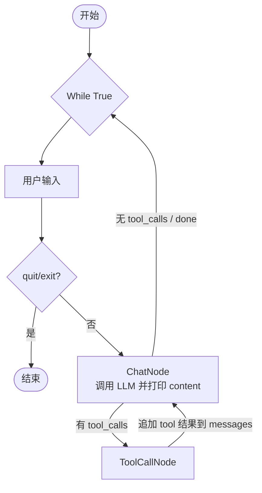

# Chatbot with Tools - 带工具调用的对话机器人

基于 `examples/chatbot` 扩展，增加了工具调用能力。

## 功能

- 接收用户输入
- LLM 决定是否调用工具（`tool_calls`）
- `ToolCallNode` 执行工具并将结果写回上下文
- LLM 基于工具结果生成最终回复
- 支持 `search` 工具进行联网信息查询

## 架构



## 文件结构

```text
chatbot_with_tools/
├── README.md
└── main.py         # ChatNode + ToolCallNode
```

## 运行

```bash
uv run examples/chatbot_with_tools/main.py
```

## 可用工具

- `read`, `write`, `edit`, `bash`, `grep`, `find`, `ls`, `search`

其中 `search` 用于联网检索最新信息；`read/grep/find/ls` 用于本地代码与文件查询。

## 关键流程说明

1. `ChatNode` 调用 `core/llm.py`，传入 `messages + tools + system_prompt`
2. `ChatNode` 将 assistant message 写回 `messages`
3. 如果 assistant message 的 `content` 不为空，立刻打印给用户
4. 若 assistant message 含 `tool_calls`，流转到 `ToolCallNode`
5. `ToolCallNode` 使用 `ToolExecutor` 解析并执行工具，结果写回 `messages`
6. 回到 `ChatNode` 二次调用模型，直到 assistant message 不再包含 `tool_calls`

这里有两层循环：

- 外层 `while True`：不断接收新的用户输入
- 内层 `ChatNode -> ToolCallNode -> ChatNode`：一次用户输入里的 agent tool loop

## 为什么先打印 content

OpenAI 风格的 assistant message 可以同时包含普通文本和工具调用：

```python
{
    "role": "assistant",
    "content": "hi",
    "tool_calls": [...]
}
```

这表示模型一边对用户说 `hi`，一边要求继续调用工具。Agent loop 不能等到最后才打印文本，否则这种“工具调用之间的中间回复”就会丢失。

所以 `ChatNode` 里要先取出并打印 `content`：

```python
content = assistant_message["content"]
if content:
    print(f"\n🤖 Assistant: {content}\n")
```

然后再判断是否存在 `tool_calls`。如果有，就执行工具并继续循环；如果没有，这条 assistant message 就是最终回复，本轮 flow 自然结束。

## 什么时候结束 loop

这个 agent loop 的结束条件非常简单：**assistant message 没有 `tool_calls` 时结束**。

```python
if tool_calls:
    return "tool_call", assistant_message

return "done", assistant_message
```

也就是说，loop 不是靠模型说“我完成了”来结束，而是靠结构化字段判断：

- 有 `tool_calls`：说明模型还想调用工具，进入 `ToolCallNode`，工具结果写回 `messages` 后再回到 `ChatNode`
- 没有 `tool_calls`：说明模型这次只是在回复用户，不再请求工具，本轮 flow 结束

所以 agent 的核心循环就是：

```text
ChatNode -> 有 tool_calls -> ToolCallNode -> ChatNode
ChatNode -> 无 tool_calls -> done
```

## 与 `chatbot` 的主要区别

1. 新增 `ToolCallNode`，负责解析并执行 tool calls。
2. 复用 `core/llm.py` 的统一调用入口，支持 `tools` 参数并返回 assistant message。
3. `ChatNode` 不再拼接纯文本 prompt，而是直接传递 `messages` 给模型。
4. 通过 `tools` 模块接入统一内置工具与执行器。
